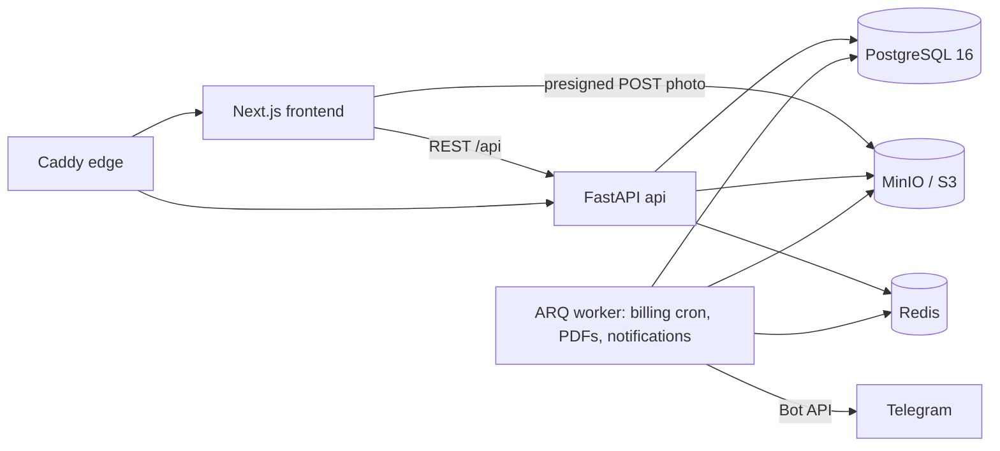
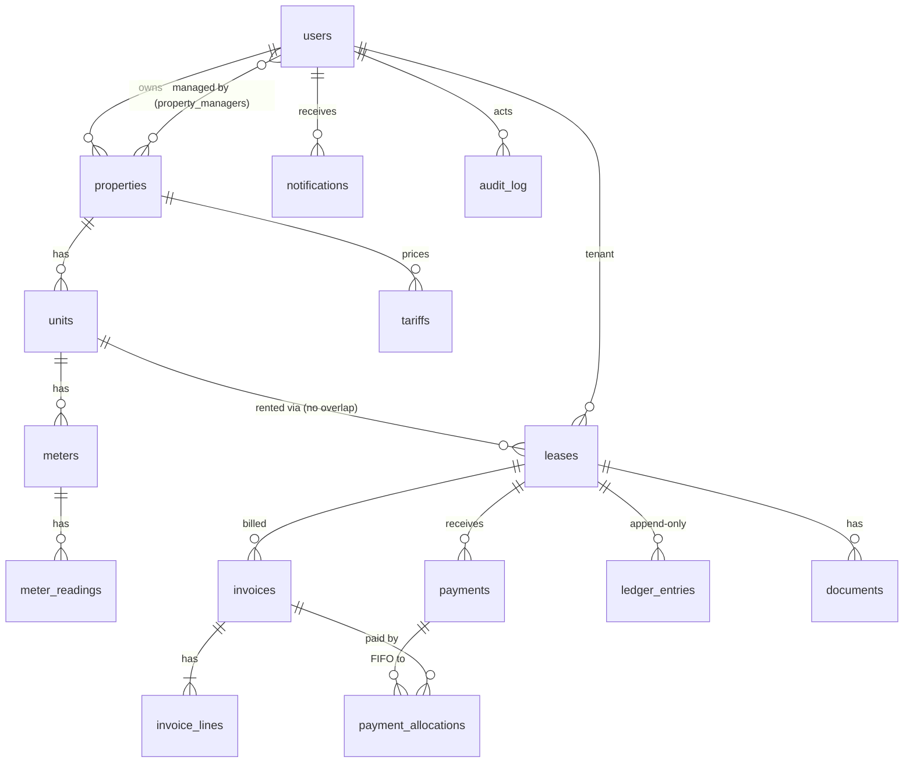

# Architecture

## Components

```mermaid
flowchart LR
  Browser[Next.js frontend] -->|REST /api| API[FastAPI api]
  Browser -->|presigned POST photo| MinIO[(MinIO / S3)]
  API --> PG[(PostgreSQL 16)]
  API --> MinIO
  API --> Redis[(Redis)]
  Worker[ARQ worker: billing cron, PDFs, notifications] --> PG
  Worker --> MinIO
  Worker --> Redis
  Worker -->|Bot API| TG[Telegram]
  Edge[Caddy edge] --> Browser
  Edge --> API
```

## Entity relationships

```mermaid
erDiagram
  users ||--o{ properties : owns
  properties ||--o{ units : has
  properties ||--o{ tariffs : prices
  properties }o--o{ users : "managed by (property_managers)"
  units ||--o{ leases : "rented via (no overlap)"
  users ||--o{ leases : tenant
  units ||--o{ meters : has
  meters ||--o{ meter_readings : has
  leases ||--o{ invoices : billed
  invoices ||--|{ invoice_lines : has
  leases ||--o{ payments : receives
  payments ||--o{ payment_allocations : "FIFO to"
  invoices ||--o{ payment_allocations : "paid by"
  leases ||--o{ ledger_entries : "append-only"
  leases ||--o{ documents : has
  users ||--o{ notifications : receives
  users ||--o{ audit_log : acts
```
